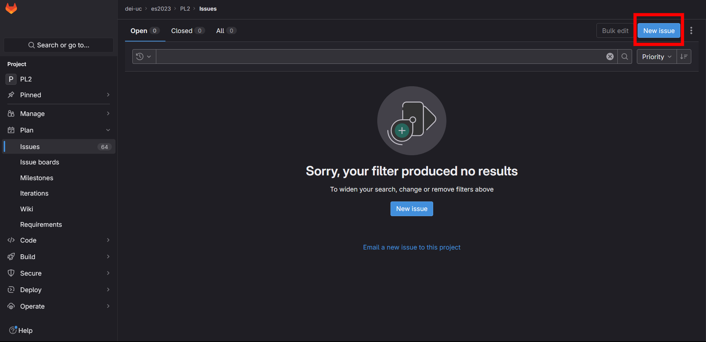

# How do you correctly contribute to this repository?

## Create an Issue

Through the "Issues" menu, create an issue.

To create the issue, you must give it:

- Title (technical and appropriate for the task)

- Definition of Done (consult the relevant template in the `PROC` folder)

- Assignee (which is usually the person who created the issue for themselves.)

- Labels (you **always need to give** _at least_ labels for the group and state)

**NOTE:** There is no need to add a due date

## Halfway There

When you finish creating it, the issue page should look like this:

## Estimate Time

After creating the issue, it's necessary to set an estimated time for it in the "Time Tracking" section of the issue page, on the sidebar to the right of the page.
The correct format is: 1mo 2w 3d 5h 10m, this translates to: 1 month, 2 weeks, 3 days, 5 hours, and 10 minutes.

## Prepare for Work

Once the Assignee is ready to start working on the issue, they should remove "state::0-ready2do" and add "state::1-doing".

Changing labels can be done through the "Labels" section in the issue page sidebar.

**NOTE:** If you are going to work on an issue as soon as you created it yourself, then skip the first one and set the "state::1-doing" label to begin with.

## Create a Merge Request

**NOTE:** You should only create a merge request after you're sure
that you need to make changes to the repository.

To create a merge request, use the button present in the page for the issue you just created, this will automatically create a branch with the name of the issue and associate the merge request with the issue.

## Commit Format

After creating the merge request, all commits should be made to the branch generated by the merge request in the following format:

- **#issueid commit_message**

Example:

- #1 Fix allowing users to write in login/register buttons

When the task is completed, change its state from "state::1-doing" to "state::2-ready2review", the reviewer will handle it from there and will contact you back if they need you to do anything

## Add Time Entry

Finally, add the time it took to complete the task in the "Time Tracking" section of the issue, where you previously set the estimated time.
